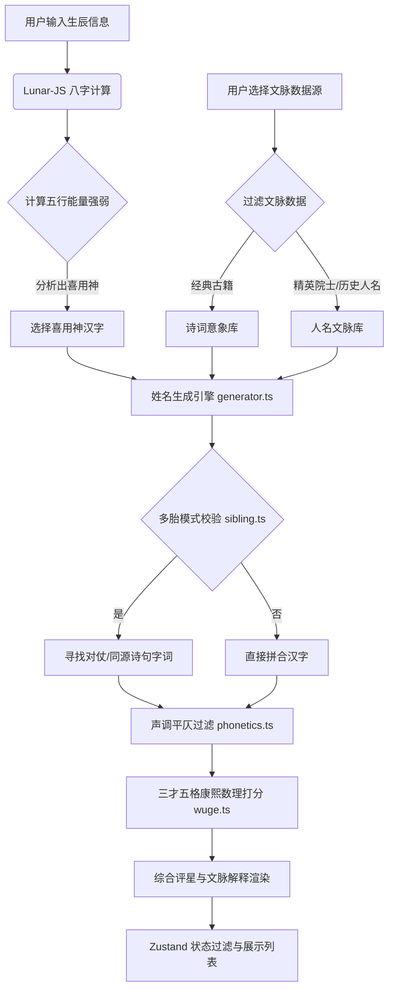

# 🌌 国风雅名 — 智能生辰八字与多胎古籍同源起名系统

[](https://react.dev/)
[](https://vite.dev/)
[](https://www.typescriptlang.org/)
[](https://github.com/pmndrs/zustand)
[](LICENSE)

**国风雅名**是一款结合了中式传统文脉与现代人工智能算法的高端起名 Web 应用程序。系统深度融合了生辰八字推演、五行喜用神分析、康熙笔画三才五格数理评分，并行业首创了“多胎/双胞胎同源古籍诗意起名”匹配算法。系统自《诗经》、《楚辞》、《周易》、《道德经》、《论语》以及历代精英院士、历史名流数据库中汲取智慧，为新生宝宝甄选音律美妙、数理吉祥、文脉深厚的文化雅名。

---
## 在线体验，请访问  https://guofengqiming.yiheautopart.com/

## 🌟 核心特色功能

### 1. ☯️ 生辰八字五行喜用神精准推演
结合 `lunar-javascript` 库，深度计算宝宝出生的干支纪年、八字排盘（天干地支）、纳音五行与藏干能量。系统动态推演宝宝的八字格局与五行强弱，精准计算出“喜用神”与“忌神”，并指导起名引擎优先挑选补足喜用神能量的汉字。

### 2. 📚 经典国风古籍文脉提炼
不仅是随机拼字，系统包含海量的国风古籍库（包括《诗经》、《楚辞》、《论语》、《周易》、《道德经》、唐诗宋词等）。每一个生成的候选名字都支持“出处溯源”，当场呈现名字对应的古诗词名句、释义以及背后的文化寓意。

### 3. ✍️ 三才五格康熙数理深度评分
严格按照传统起名中的《康熙字典》繁体笔画数进行推演。智能解析天格、人格、地格、总格、外格的灵动数理吉凶，自动判断三才配置（木、火、土、金、水）的相生相克关系，并综合“声律平仄”、“字形美感”进行百分制深度打分。

### 4. 👥 行业首创：多胎/双胞胎古籍同源算法
专门为二胎、双胞胎、三胞胎等家庭研发。起名时能将“长幼兄弟姐妹”的名字进行血脉关联：
- **同源诗句法**：从同一句古诗、同一个意象或者对仗诗句中为多个宝宝抽取名字（如“朝雨”与“轻尘”源自“朝雨浥轻尘”）。
- **同义对仗法**：确保两两名字字义对仗、词性相称，让名字血脉相连、相辅相成。

### 5. 🎨 极致视觉与交互设计
采用沉浸式国风视觉设计：
- 完美契合的国风渐变与墨韵背景，支持**明暗主题切换**（Light / Dark / System Mode）。
- 带有毛玻璃质感的磨砂微动弹窗、收藏夹和历史记录面板。
- 基于 **Zustand** 进行全局高效状态管理，配合本地数据持久化（localStorage），保障核心选择不丢失。

---

## 🛠️ 项目架构与技术栈

### 核心技术栈
- **前端核心**：React 19 + TypeScript + Vite 8
- **状态管理**：Zustand 5 (配合 `persist` 中间件实现收藏、历史和主题的本地持久化)
- **历法解析**：`lunar-javascript`
- **样式方案**：原生精细 CSS 约束设计（全暗黑模式适配）
- **数据加载**：异步 `fetch()` 分块动态加载技术（解耦大体量 JSON 名字库，实现首屏秒开）

### 📐 数据流与起名计算架构图



---

## 📂 项目目录结构说明

```bash
G:\poetic-naming-app
├── public/                 # 静态资产目录
│   ├── data/               # 核心起名数据集（异步加载）
│   │   ├── names/          # 七大精英名流与历史人名库 (古人云, 登科录, 财富论等)
│   │   ├── char_dict.json  # 康熙五行拼音大字典 (约2MB)
│   │   ├── char_radical.json # 偏旁部首映射表
│   │   ├── classics.json   # 诗经/楚辞/易经等经典古籍大库
│   │   ├── sancai.json     # 三才配置映射表
│   │   └── gender_hint.json # 字词性别倾向暗示库
│   ├── favicon.svg         # 网站图标
│   └── *.png               # 国风背景图及微信二维码
├── scripts/                # 构建、测试与维护脚本
│   ├── update_main_site.js # 网站远程优雅部署与重载脚本
│   └── run-tests.js        # 本地算法自动化集成测试脚本
├── src/                    # React 源代码目录
│   ├── components/         # 模块化 UI 组件
│   │   ├── ControlPanel.tsx   # 起名控制表单面板
│   │   ├── NameFlowList.tsx   # 智能起名推荐流列表
│   │   ├── DetailModal.tsx    # 名字三才五格及诗意详情解析弹窗
│   │   ├── BaziResult.tsx     # 八字干支与五行排盘展示
│   │   ├── SiblingPairEval.tsx# 多胎同源科学评估组件
│   │   ├── FavoritePanel.tsx  # 收藏篮子悬浮面板
│   │   ├── HistoryPanel.tsx   # 起名历史记录面板
│   │   └── LoadingScreen.tsx  # 带有古风文脉的载入动效
│   ├── engine/             # 核心计算与算法引擎
│   │   ├── bazi.ts            # 天干地支与喜用神推算
│   │   ├── generator.ts       # 核心名字生成与古籍意象匹配器
│   │   ├── sibling.ts         # 多胎同源/对仗关系匹配引擎
│   │   ├── wuge.ts            # 三才五格康熙笔画评分系统
│   │   └── phonetics.ts       # 平仄、避讳与音调校验器
│   ├── services/           # 服务层
│   │   └── dataLoader.ts      # 名字大文件的异步惰性加载单例服务
│   ├── store/              # 状态层
│   │   └── index.ts           # Zustand 全局 Store，导出高效 Selectors
│   ├── App.tsx             # 页面主入口与骨架布局
│   ├── index.css           # 包含墨韵渐变与毛玻璃的主样式表
│   └── main.tsx            # React 挂载点
├── tsconfig.json           # TypeScript 配置文件
└── vite.config.ts          # Vite 构建配置
```

---

## 🚀 本地开发与启动指南

### 1. 克隆项目与安装依赖
确保您的本地已安装 [Node.js](https://nodejs.org/) (建议 v18+)。在项目根目录下执行：
```bash
# 安装所需依赖 (lunar-javascript, zustand 等)
npm install
```

### 2. 本地开发启动
启动 Vite 热重载本地开发服务器：
```bash
npm run dev
```
打开浏览器访问：`http://localhost:5173` 即可进行开发与预览。

### 3. 运行自动化测试
项目中包含了对五行推演、三才五格评分和多胎匹配算法的测试用例。可以通过如下命令运行本地单元与集成测试，验证核心引擎的稳定性：
```bash
npm run test
```

### 4. 项目打包构建
在部署前将项目编译为生产环境产物：
```bash
npm run build
```
构建成功后的静态资产将输出至 `dist/` 目录。

---

## 🔒 授权与声明
本项目完全开源，遵循 **MIT 许可证**，起名推算算法由中式古籍及周易数理推演而来，仅供新生儿起名参考与文化研究使用。
